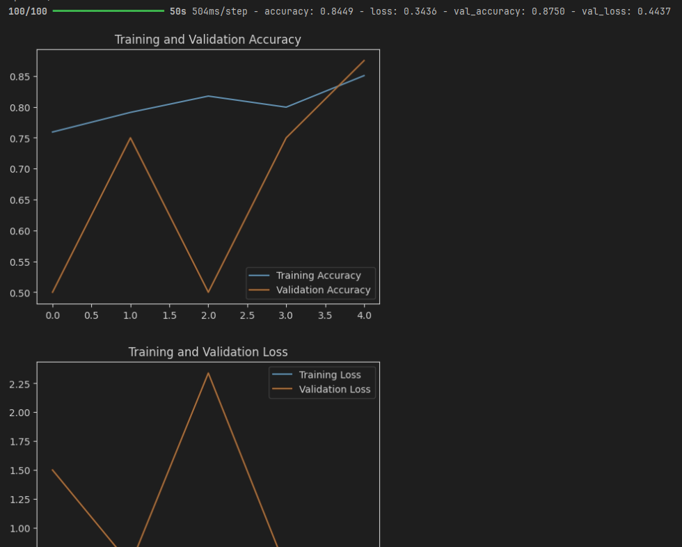

# 深度学习基础课程实验
## 项目简介
本项目基于深度学习基础（由张磊老师开设，课程代码为AIB310003）相关工程基础进行实验操作与优化
## 项目说明
卷积神经网络( CNN )是一种广泛用于图像分类、对象识别等任务的深度学习模型.

在本项目中,我们将使用一个常见的肺炎 CT 数据集进行二分类任务,来加深理解 CNN结构对模型表现的影响。

在这个过程中，本人根据课上所学的知识，对模型的结构和参数进行调整，从而实现最佳的预测效果。

**具体目标**
1. CNN代码的熟悉与优化
2. 分类准确率达标

对于目标一，本人在说明文档中首先进行CNN原代码的理解说明，进而通过调整和优化其结构和参数，从而达到代码优化的效果
对于目标二，本人在本地机器运行原代码后，得到以下结果（均为5个epoch后的结果）：
* **model1**：accuracy: 0.8528 - loss: 0.3223 - val_accuracy: 0.8750 - val_loss: 0.3972
* **model2**：accuracy: 0.9009 - loss: 0.2467 - val_accuracy: 0.5000 - val_loss: 10.5230（有点难看）

    一开始觉得不对劲，又跑了一遍：accuracy: 0.8797 - loss: 0.2861 - val_accuracy: 0.5000 - val_loss: 13.9029，结果更差，那么果然是网络结构的问题
* **model3**：accuracy: 0.8004 - loss: 0.4226 - val_accuracy: 0.8750 - val_loss: 0.4114

---

## 目标一：代码优化 & 目标二：结果截图

---

### 模型一
```python
model = models.Sequential([
        #卷积层，提取图像局部特征
    layers.Conv2D(32, (3, 3), activation='relu', input_shape=(150, 150, 3)),#过滤器数量32，卷积核大小3*3，激活函数RELU，输入图像的大小150*150*3通道
    layers.MaxPooling2D((2, 2)),#池化层，缩小特征图尺寸，保留重要特征
    layers.Conv2D(64, (3, 3), activation='relu'),
    layers.MaxPooling2D((2, 2)),
    layers.Flatten(),
    layers.Dense(128, activation='relu'),#全连接层，综合所有特征，完成分类或回归
    layers.Dense(1, activation='sigmoid')#输出层
])
```
这个模型定义了：
1. 卷积层，用来提取图像的局部特征

   * 32：输出特征图的通道数。
   * (3, 3)：卷积核大小是 3x3。 
   * activation='relu'：使用 ReLU 激活函数，引入非线性。 
   * input_shape=(150, 150, 3)：输入图像尺寸是 150x150，RGB 三通道。
   * 输出形状为：(148, 148, 32)
2. 池化层，用于下采样，减小尺寸，减少计算量
   * (2, 2)：使用 2x2 的窗口进行最大池化，相当于每 2x2 区域只保留最大值
   * 说明：输出形状应当变成 (74, 74, 32)
3. 卷积层：64：filter数量增加到 64
4. 池化层：再次进行下采样，形状变为 (36, 36, 64)
5. 展平
6. 全连接层：128个神经元，RELU激活
7. 输出层：sigmoid函数，二分类输出

优化手段有以下几个方向可以考虑，这里我采用了调整filter的个数和大小、调整池化层大小、增加卷积层层数进行优化：

---

#### 调整filter个数和大小
1. filter个数设置为64->128，大小设置为3*3

验证结果：- accuracy: 0.8449 - loss: 0.3436 - val_accuracy: 0.8750 - val_loss: 0.4437

截图

2. filter个数设置为32->64，大小设置为5*5

依据：本人认为更大的卷积核可以带来更大的感受野，放在第一层卷积层进行调整

验证结果： accuracy: 0.8267 - loss: 0.3805 - val_accuracy: 0.9375 - val_loss: 0.5018

截图：


可以看到结果非常的好（出乎我的意料）

---

#### 调整池化层大小

考虑到下采样的时候，可能会出现损失更多特征的情况，因此这里只尝试padding从2到3的调整


嗯，预想到的差。。。。

---

#### 增加卷积层层数

在这里为了将网络发展更深，特征提取更完全，虽然说会有计算量过大，过拟合等各种风险，不过作为一个基础模型的改进，值得一试

我这里采用了两个一组形成一个卷积块的想法，将每一层卷积层更改为卷积块
示例代码如下：
```python
model = models.Sequential([
    layers.Conv2D(32, (5, 5), activation='relu', input_shape=(150, 150, 3)),
    layers.Conv2D(32, (3, 3), activation='relu'),         # 新增卷积层
   
    layers.MaxPooling2D((3, 3)),
   
    layers.Conv2D(64, (3, 3), activation='relu'),
    layers.Conv2D(32, (3, 3), activation='relu'),         # 新增卷积层
   
    layers.MaxPooling2D((3, 3)),
    layers.Flatten(),
    layers.Dense(128, activation='relu'),
    layers.Dense(1, activation='sigmoid')
])
```
当然，可想而知，结果也是非常的nice！

验证准确率也是到达了93.75%
---
**模型一的魔改就暂时做到这里吧。。。。还有剩下的两个模型**

### 模型二
```python
model = models.Sequential([
    layers.Conv2D(32, (3, 3), activation='relu', input_shape=(150, 150, 3)),
    layers.BatchNormalization(),#批归一化层，标准化激活值，提高训练稳定性
    layers.MaxPooling2D((2, 2)),
    layers.Conv2D(64, (3, 3), activation='relu'),
    layers.BatchNormalization(),
    layers.MaxPooling2D((2, 2)),
    layers.Conv2D(128, (3, 3), activation='relu'),
    layers.BatchNormalization(),
    layers.MaxPooling2D((2, 2)),
    layers.Flatten(),
    layers.Dense(128, activation='relu'),
    layers.Dense(1, activation='sigmoid')
])
```
这个模型相较于上面的模型：
* 在每一个卷积层后面加了一个BatchNormalization()， 防止梯度消失或爆炸 ，同时加快收敛速度，提升训练稳定性
* 在实验中发现，加入批归一层的确可以加速训练，但是在验证集上面表现太差了，明显过拟合

本人认为是因为模型更复杂导致的，因此优化方向也比较明确：
* 引入Dropout防止过拟合
* 更改网络结构

以下基于上述优化想法进行实验：
#### 优化一：Dropout
我们在这里引入了Dropout，尝试在全连接层中丢弃神经元，在第一次尝试中，使用了
```python
layers.Dropout(0.5)
```
结果非常的丑陋，损失一度到达了大几十。。。

在之后对每一个卷积层，加入了一个Dropout，如下面代码所示
```python
model = models.Sequential([
    layers.Conv2D(32, (3, 3), activation='relu', input_shape=(150, 150, 3)),
    layers.BatchNormalization(),#批归一化层，标准化激活值，提高训练稳定性
    layers.MaxPooling2D((2, 2)),
    layers.Dropout(0.25),
        
    layers.Conv2D(64, (3, 3), activation='relu'),
    layers.BatchNormalization(),
    layers.MaxPooling2D((2, 2)),
    layers.Dropout(0.25),
        
    layers.Conv2D(128, (3, 3), activation='relu'),
    layers.BatchNormalization(),
    layers.MaxPooling2D((2, 2)),
    layers.Dropout(0.25),
        
    layers.Flatten(),
    layers.Dense(128, activation='relu'),
    layers.Dropout(0.5), #随机丢弃50%的神经元
    layers.Dense(1, activation='sigmoid')
])
```
不过结果也没有好到哪里去。。。截图放在下面：


于是接下来准备对网络结构动手了

#### 优化二：网络结构+Dropout

优化代码如下所示：
```python
    # 第一个卷积块
    layers.Conv2D(32, (3, 3), activation='relu', input_shape=(150, 150, 3)),
    layers.BatchNormalization(),
    layers.Conv2D(32, (3, 3), activation='relu'),
    layers.BatchNormalization(),
    layers.MaxPooling2D((2, 2)),
    layers.Dropout(0.25),

    # 第二个卷积块
    layers.Conv2D(64, (3, 3), activation='relu'),
    layers.BatchNormalization(),
    layers.Conv2D(64, (3, 3), activation='relu'),
    layers.BatchNormalization(),
    layers.MaxPooling2D((2, 2)),
    layers.Dropout(0.25),

    # 第三个卷积块
    layers.Conv2D(128, (3, 3), activation='relu'),
    layers.BatchNormalization(),
    layers.Conv2D(128, (3, 3), activation='relu'),
    layers.BatchNormalization(),
    layers.MaxPooling2D((2, 2)),
    layers.Dropout(0.25),

    # 全连接层
    layers.Flatten(),
    layers.Dense(128, activation='relu'),
    layers.BatchNormalization(),
    layers.Dropout(0.5),

    # 输出层
    layers.Dense(1, activation='sigmoid')
```
虽然说和85%的准确率差得多，但是你看准确率是不是大幅度提升了！（已疯）

对比来看，进步显著


但是发现验证集上的准确率永远是50%,也就是说，依然是过拟合的，模型在验证集上永远是像抛硬币一样进行测试

所以考虑还是先从网络的参数入手进行调整

#### 优化三：网络参数

由于是过拟合导致的准确率下降，因此采用通过：
* 调整全连接层的神经元个数
* 调整卷积核个数和大小

以下逐个进行调整

---

##### 全连接层
在这里我们尝试使用128->64->32->16个神经元进行实验，观察性能是否改善

实验结果记录如下：
1. 256：accuracy: 0.8996 - loss: 0.2422 - val_accuracy: 0.5000 - val_loss: 45.2598

2. 128：accuracy: 0.9081 - loss: 0.2250 - val_accuracy: 0.5000 - val_loss: 26.4928

3. 64：accuracy: 0.8921 - loss: 0.2974 - val_accuracy: 0.5000 - val_loss: 22.9473

4. 32：accuracy: 0.8818 - loss: 0.3160 - val_accuracy: 0.5000 - val_loss: 18.0375

5. 16：accuracy: 0.8294 - loss: 0.3451 - val_accuracy: 0.5000 - val_loss: 13.4406


##### 卷积核
在上述调整优化中，我们发现适当减少全连接层的神经元个数，有助于降低验证损失，因此在本部分，我们基于采用dropout后的模型进行卷积核层面的调整优化

本部分实验采用全连接层为32个神经元的模型

**baseline：accuracy: 0.8818 - loss: 0.3160 - val_accuracy: 0.5000 - val_loss: 18.0375**

**基于思想：更少的卷积核会提取更浅更少的特征，不易出现过拟合现象，更小的卷积核感受野更小，学习的特征更少**
1. 采用 32 + 64 + 128 -->> 32 + 32 + 64结构

   实验结果：
accuracy: 0.8832 - loss: 0.3016 - val_accuracy: 0.7500 - val_loss: 0.3997


额 看结果 像瞎猫碰到死耗子了
重新跑一次：

确实碰到死耗子了。 但是较于baseline，损失降低了
2. 采用 32 + 32 + 32结构

实验结果：accuracy: 0.9026 - loss: 0.2205 - val_accuracy: 0.5000 - val_loss: 5.1813

3. 直接对网络动手吧
**基于：更多的 filters + BN = 更强表达能力 + 更快训练，但更容易过拟合**

简单来说，BN在这个小网络中训练太过于激进了，那么就把卷积核变小，同时适当丢弃一定的神经元，并且考虑取消一些BN的操作，以下为优化代码：
```python
layers.Conv2D(8, (3, 3), activation='relu', input_shape=(150, 150, 3),
                      kernel_regularizer=regularizers.l2(0.001)),
#layers.BatchNormalization(),
layers.MaxPooling2D((2, 2)),

layers.Conv2D(8, (3, 3), activation='relu',
                      kernel_regularizer=regularizers.l2(0.001)),
#layers.BatchNormalization(),
layers.MaxPooling2D((2, 2)),
        
layers.Conv2D(8, (3, 3), activation='relu',
                      kernel_regularizer=regularizers.l2(0.001)),
#layers.BatchNormalization(),
layers.MaxPooling2D((2, 2)),
        
layers.Conv2D(8, (3, 3), activation='relu',
                      kernel_regularizer=regularizers.l2(0.001)),
layers.BatchNormalization(),
layers.MaxPooling2D((2, 2)),

layers.Flatten(),

layers.Dense(8, activation='relu', kernel_regularizer=regularizers.l2(0.001)),
layers.Dense(1, activation='sigmoid')
```
实验结果：


你已经很棒了！
模型二就到这里吧，如果不引入BN的话，这个模型的优化还是很轻松的

### 模型三
模型三还是比较友好的，我这里只提供一种修改思路：

我们观察之后看到，模型引入了更深的网络结构，但是其实并没有过拟合，因此在这里考虑修改filter的个数

本人在这里将原代码的最后一个卷积层filter个数从256修改为128

```python
model = models.Sequential([
    layers.Conv2D(32, (3, 3), activation='relu', input_shape=(150, 150, 3)),
    layers.MaxPooling2D((2, 2)),
    layers.Conv2D(64, (3, 3), activation='relu'),
    layers.MaxPooling2D((2, 2)),
    layers.Conv2D(128, (3, 3), activation='relu'),
    layers.MaxPooling2D((2, 2)),
    layers.Conv2D(128, (3, 3), activation='relu'),
    layers.MaxPooling2D((2, 2)),
    layers.Flatten(),
    layers.Dense(256, activation='relu'),
    layers.Dense(1, activation='sigmoid')
])
```
结果也是非常的好

实验结果：accuracy: 0.7695 - loss: 0.4382 - val_accuracy: 0.9375 - val_loss: 0.3469
截图：


那么如果把网络结构再加深一点呢？

在这里采用两种加深方法(虽然说不可避免地会造成计算量的急剧上升)：

1. 直接加入一层卷积层，
```python
    layers.Conv2D(512, (3, 3), activation='relu'),
    layers.MaxPooling2D((2, 2)),
```

没有预想的那么好，不过相较于原来的baseline，也是有很大的改进了

2. 将前面所有的卷积层加倍形成卷积块
```python
model = models.Sequential([
    layers.Conv2D(32, (3, 3), activation='relu', input_shape=(150, 150, 3)),
    layers.MaxPooling2D((2, 2)),
        
    layers.Conv2D(64, (3, 3), activation='relu'),
    layers.Conv2D(64, (3, 3), activation='relu'),
    layers.MaxPooling2D((2, 2)),
        
    layers.Conv2D(128, (3, 3), activation='relu'),
    layers.Conv2D(128, (3, 3), activation='relu'),
    layers.MaxPooling2D((2, 2)),
        
    layers.Conv2D(256, (3, 3), activation='relu'),
    layers.Conv2D(256, (3, 3), activation='relu'),
    layers.MaxPooling2D((2, 2)),
        
    # layers.Conv2D(512, (3, 3), activation='relu'),
    # layers.Conv2D(512, (3, 3), activation='relu'),
    layers.MaxPooling2D((2, 2)),
        
    layers.Flatten(),
    layers.Dense(256, activation='relu'),
    layers.Dense(1, activation='sigmoid')
])
```


